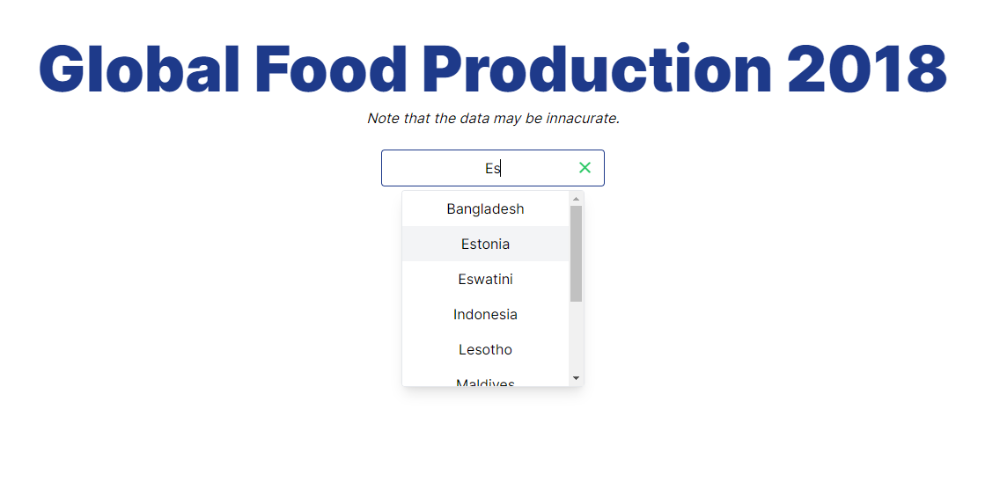
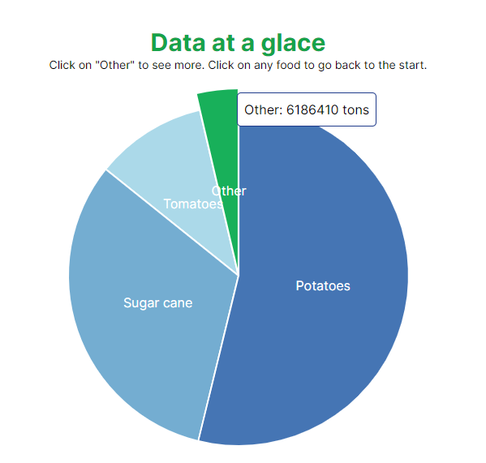
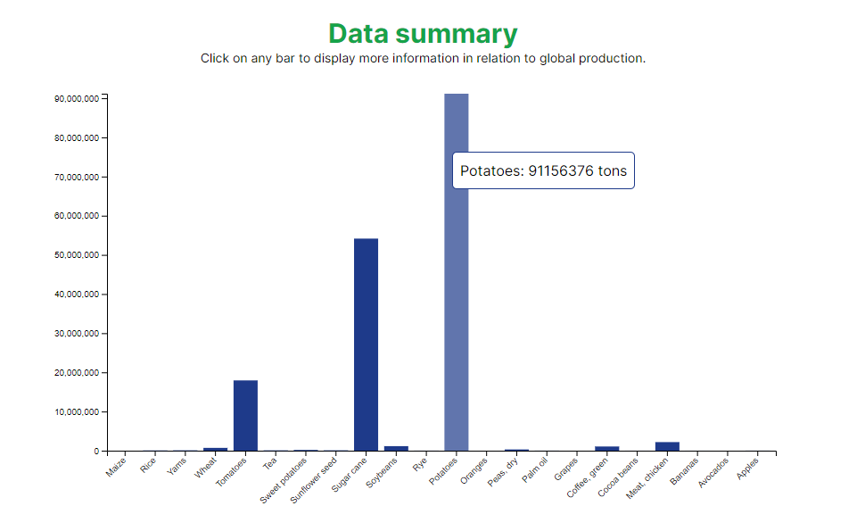
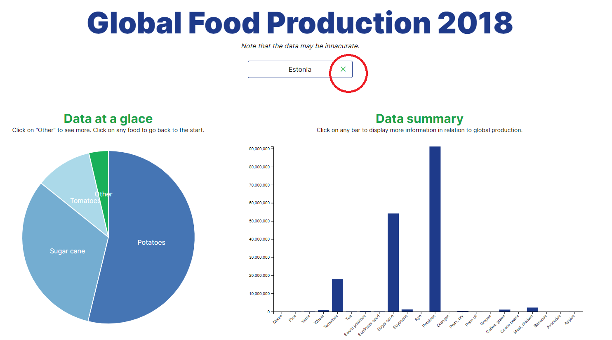

# Global Food Production 2018

## Project Description

Write a brief description of your application here. The description should provide an overview of the application features, its purpose, and how it achieves the objective of the assignment. Discuss the dataset used and why it was chosen.

Describe the insights you are providing through your interactive visualization. Highlight the questions this project is intended to answer or the insights you aim to provide.

---- 

The application presents the food production of 154 countries in 2018. The data set includes 22 foods. Each country's food production of the included foods in presented in tons. The application presents the data both summarized or in detail. The user is able to see the percentage of a certain food's production in relation to the global production for the selected country.

The dataset used was chosen because it provided a large range of values across many years. Unfortunately upon closer inspection, many countries were not featured during certain years; the data was incomplete or even faulty. Due to a lack of proficiency in the subject, this was omitted until it was too late. 

The idea of the project was to be able to clearly see which country excels in a particular area of food production and how they perform at a global scale.

## Core Technologies

Include a list of the main technologies used in your project. Explain why you decided to use these technologies and what benefits they have provided in accomplishing your goals. This can include the backend framework, data analysis and processing tools, data visualization library, frontend technology, and deployment platform.

-- 

### Backend
- Express: chosen in order to create an HTTP server that follows simple REST architecture. 
- Node.js: chosen because familiar with it mainly. It works with async requests and its non-blocking incoming requests.
- Mongodb: used to create schemas in order to organize the data.
- Elastic Search: used to quickly search the data available, although larger amounts of data is needed to test its full capabilities.

### Frontend
- Next.js: chosen for its ease of use when creating react components that use JSX.
- Tailwind CSS: chosen for being able to style HTML inline, great for testing styles quickly in smaller projects like this single page application.
- Typescript: chosen for providing type safety to Javascript. 

## How to Use

This section should contain instructions for how to use your application. Explain the controls used in your visualization and how to interact with it to uncover different insights. Providing screenshots and/or gifs can greatly help users understand how to use your application.

---

To start the application either write the country name (autofill enabled) in the input box or select it from the dropdown or a combination of both.

The left graph displays the total food production for the country selected, with foods under the threshold of 5% being grouped up into the "Other" category. This is to better display the data when as a pie in order to not have values values that are unreadable. Clicking on other will display all the foods under the threshold, until no more foods are under the threshold. Clicking on any other food, at any other point during the pie will take the user back to the original pie, with the overall data representation. Tooltips are present for more information.

The right graph displays the total food production for the country selected with bars, all foods represented. Clicking on any of the bars(that represent a food) will trigger a popup window with a pie graph that shows the percentage of that food's production in relation to the global production of that food. Clicking on the "x" inside the popup will close the popup. Tooltips are present for more information.

Clicking on the "x" inside the original input for selecting a country will reset the application and the user will be able to select another country if he/she so wishes.

## Link to the Deployed Application

Include a link to the deployed application. The application should be hosted on a platform that allows public access.

---

Link to the application: 

## Additional features

Explain how you have addressed the assignment requirements. If you've added any custom functionality, discuss them in this section and link to the specific issues you have closed.

---

Animations added for visual appeal and in order to guide the user through the application. 

Tested 2 different kinds of visualizations: pie chart and bar chart.

## Acknowledgements

Include a list of resources you found helpful, attributions, or shoutouts here.

---

Link to the dataset: https://www.kaggle.com/datasets/rafsunahmad/world-food-production/data 
Link to bar chart with animation tutorial: https://d3-graph-gallery.com/graph/barplot_animation_start.html
Link to pie chart tutorials: https://d3-graph-gallery.com/pie.html 
Inspiration for pie chart animation: https://observablehq.com/d/0644a8df66dd6bab 